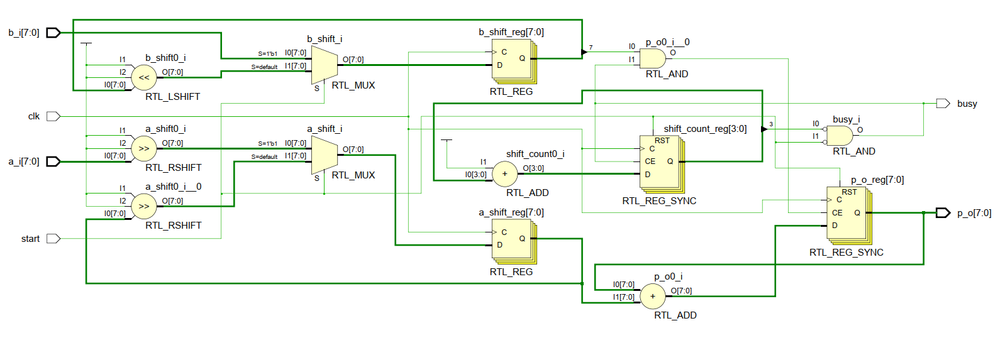
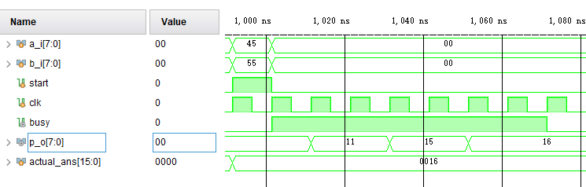
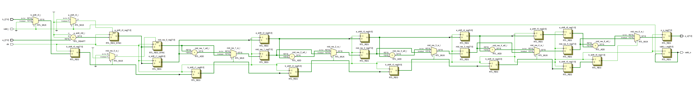
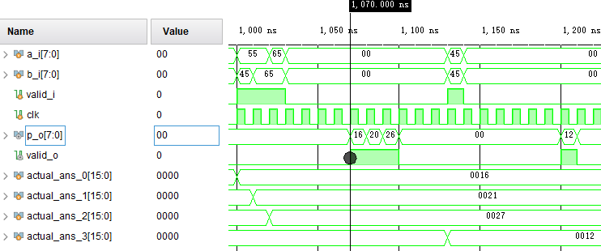
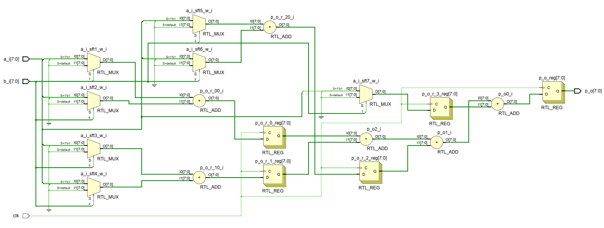
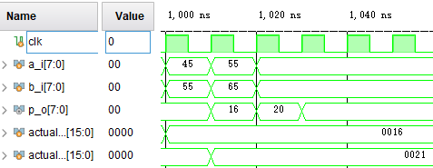

# 作业1 三种结构的无符号数乘法器模块

使用器件型号：xa7a12tcpg238-2I

## 1 循环结构

### 1.1 主要结构示意图

### 1.2 资源占用率

|        Site Type        | Used | Fixed | Available | Util% |
| :----| -----| ----- | --------  | ----- |
| Slice LUTs*             |   19 |     0 |      8000 |  0.24 |
| Slice Registers         |   27 |     0 |     16000 |  0.17 |
| F7 Muxes                   |    0 |     0 |      7300 |  0.00 |
| F8 Muxes                   |    0 |     0 |      3650 |  0.00 |

### 1.3 延迟周期数

由图可知，循环结构的延迟为8个时钟周期。

### 1.4 最高工作频率

Clock | Edges (WNS) | WNS (ns) | WHS (ns) | WPWS (ns) | Total Endpoints (TNS) |
|:----- | :----- |----- | ----- | ----- | ----- |
|clk | rise-rise | 8.201 | 0.063 | 4.5 | 37 |

由
F_max = 1/(T-WNS)
且
T = 10(ns),
可求
F_max = 555.86 MHz

## 2 流水线结构

### 2.1 主要结构示意图

### 2.2 资源占用率

|          Site Type         | Used | Fixed | Available | Util% |
| :----| -----| ----- | --------  | ----- |
| Slice LUTs*                |   30 |     0 |      8000 |  0.38 |
| Slice Registers            |   87 |     0 |     16000 |  0.54 |
| F7 Muxes                   |    0 |     0 |      7300 |  0.00 |
| F8 Muxes                   |    0 |     0 |      3650 |  0.00 |

### 2.3 延迟周期数

由图可知，串行流水线结构的延迟为7个时钟周期。

### 2.4 最高工作频率

Clock | Edges (WNS) | WNS (ns) | WHS (ns) | WPWS (ns) | Total Endpoints (TNS) |
----- | ----- | ----- |----- | ----- | ----- |
clk | rise-rise | 7.82 | 0.065 | 4.146 | 84 |

由
F_max = 1/(T-WNS)
且
T = 10(ns),
可求
F_max = 458.72 MHz

## 3 并行结构

### 3.1 主要结构示意图

### 3.2 资源占用率

|        Site Type        | Used | Fixed | Available | Util% |
| :----| -----| ----- | --------  | ----- |
| Slice LUTs*             |   22 |     0 |      8000 |  0.28 |
| Slice Registers         |   27 |     0 |     16000 |  0.17 |
| F7 Muxes                |    0 |     0 |      7300 |  0.00 |
| F8 Muxes                |    0 |     0 |      3650 |  0.00 |

### 3.3 延迟周期数

由图可知，并行结构的延迟为1个时钟周期。

### 3.4 最高工作频率

Clock | Edges (WNS) | WNS (ns) | WHS (ns) | WPWS (ns) | Total Endpoints (TNS) |
----- | ----- | ----- |----- | ----- | ----- |
clk | rise - rise | 7.374 | 0.166 | 4.5 | 8 |

由
F_max = 1/(T-WNS)
且
T = 10(ns),
可求
F_max = 380.81 MHz

